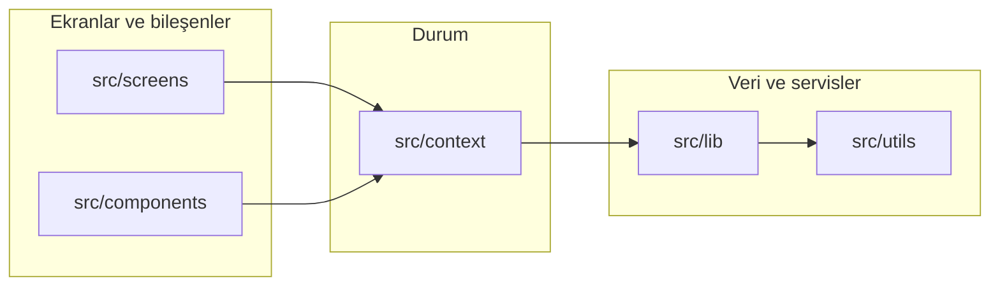

# Planly (DailyscheduleApp) — klasör rehberi

Bu dosya, projede **neyin nerede olduğunu** ve **birbirine nasıl bağlandığını** özetler.

## Proje kökü (`DailyscheduleApp/`)

| Öğe | Rol |
|-----|-----|
| `App.js` | Giriş bileşeni: provider’lar (Supabase, tema, görevler, abonelik), reklam başlatma, `AppNavigator`. |
| `index.js` | Expo giriş noktası; `setupNativeNavigation` ve `App` kaydı. |
| `app.json` / `app.config.js` | Expo yapılandırması (isim, sürüm, ikon, `extra` ortam değişkenleri, eklentiler). |
| `eas.json` | EAS Build / Submit profilleri (`production`, `preview`, …). |
| `package.json` | Bağımlılıklar ve npm script’leri. |
| `.easignore` | EAS arşivinde **hariç** tutulacak dosyalar (log, IDE çöplüğü vb.). |
| `.gitignore` | Git’e **girmemesi** gerekenler (`node_modules`, `.env`, …). |
| `.env` | Yerel sırlar (Git’te yok); `.env.example` şablon içindir. |

**Neden hepsi kökte?** `package.json`, `app.json`, `app.config.js`, `babel.config.js`, `eas.json`, `index.js` gibi dosyalar **Expo / npm / Metro / EAS** tarafından proje kökünde aranır; alt klasöre taşınamaz (araçlar bozulur). Karışıklığı azaltmak için Explorer’da gereksiz kök öğeleri **kapalı** tutmak ve bu rehberi kullanmak yeterli.

## Native Android (`android/`)

**Bu klasörün iç yapısı taşınmaz** — Gradle ve Android Studio sabit dizin bekler (`app/build.gradle`, `AndroidManifest.xml`, `java/...`, `res/...`).  
Burada yaptığın değişiklikler: paket adı, izinler, imzalama, ikon/splash kaynakları.

- Explorer’da listeyi kısaltmak için **`android` klasörünü kapalı tut** (ok işaretine tıkla).

## Varlıklar ve script’ler

| Klasör / dosya | Rol |
|----------------|-----|
| `assets/` | Uygulama ikonu, splash, favicon (Expo `app.json` ile bağlı). |
| `scripts/` | Örn. ikon üretimi (`generate_app_icons.py`) gibi yardımcı araçlar. |
| `docs/` | Dokümantasyon (bu rehber, yayın notları, politikalar). |

## Supabase SQL (`supabase/`)

Bu klasördeki `.sql` dosyaları **uygulama paketinden çalıştırılmaz**; Supabase projende **SQL Editor** ile elle uygulanır. Yerleşim:

| Yol | Rol |
|-----|-----|
| `README.md` | API anahtarları, anon auth, ortam değişkenleri özeti. |
| `ROLLOUT_ORDER.txt` | Betikleri hangi sırayla çalıştıracağın. |
| `sql/schema.sql` | İlk kurulum: `profiles`, `tasks`, RLS, tetikleyiciler. |
| `sql/upgrades/` | Mevcut veritabanına **sonradan** eklenecek kolon/tablolar. |
| `sql/optional_alternatives/` | Sadece görev tablosu eksik gibi **alternatif** kurulumlar (dosyalar birbirinin yerine; hepsini birden çalıştırma). |
| `sql/settings/` | Ayarlar ekranı ile ilgili ek SQL. |

## Uygulama kaynak kodu (`src/`)

### `src/navigation/`

React Navigation: **sekme**, **stack**, giriş akışı. Ekranlar buradan bağlanır.

### `src/screens/`

Tam sayfa ekranlar: Ana sayfa, görev listesi, ayarlar, istatistik, paywall vb.

### `src/components/`

Yeniden kullanılabilir parçalar; alt klasörler **alan**a göre:

| Alt klasör | İçerik |
|------------|--------|
| `common/` | Buton, tab ikonu, metin linki gibi genel UI. |
| `layout/` | Ekran başlığı, bölüm başlığı gibi yerleşim. |
| `dashboard/` | Ana sayfa / özet kartları, görev satırı, ilerleme çubuğu vb. |
| `tasks/` | Görev ekleme modalı, filtre / öncelik çipleri. |
| `calendar/` | Hafta şeridi / takvim kartı. |
| `settings/` | Ayarlar satırı bileşenleri. |
| `sync/` | Bulut profil senkronu, yükleme banner’ı. |
| `ads/` | AdMob banner ve uygulama açılış reklamı denetleyicisi (UI + tetikleyici). |

### `src/context/`

React Context: **global durum** — görevler, tema, Supabase oturumu, abonelik (RevenueCat).

### `src/lib/`

İş mantığı ve **harici servisler** (dosya adlarıyla):

| Yol | Rol |
|-----|-----|
| `lib/ads/` | Reklam gösterimi, sıklık, AdMob format kaydı. |
| `lib/supabase/` | Supabase yardımcıları (ör. `env`, `mergeUserPreferences`). |
| `lib/supabaseClient.js` | Supabase istemci oluşturma. |
| `lib/taskRemote.js` | Görev satırlarının uzak DB ile eşlenmesi. |
| `lib/profileRemote.js` | Kullanıcı profili çekme / güncelleme. |

### `src/utils/`

Saf yardımcılar: tarih anahtarı, yerel görev depolama, sıralama, istatistik hesaplama, ayarlar anahtarları.

### `src/theme/`

Renk paletleri, gölgeler — `ThemeContext` ile birlikte kullanılır.

### `src/constants/`

SQL şema / operasyon metinleri (görev tablosu ile uyumlu).

### `src/data/`

Statik veri (ör. günlük motivasyon alıntıları).

### Kök `src/` dosyaları

| Dosya | Rol |
|-------|-----|
| `setupNativeNavigation.js` | Native stack davranışı için tek seferlik ayar (index’ten import). |

---

## Veri ve ekran akışı (özet)

---

## İsteğe bağlı: daha da sade görünüm

- IDE’de **`android`** ve **`node_modules`** klasörlerini **kapalı** tut.
- İleride **feature klasörleri** (`src/features/gorevler/…`) gibi bir yapı istenirse, bu refaktör ayrı planlanır (çok dosyada import güncellemesi gerekir).
